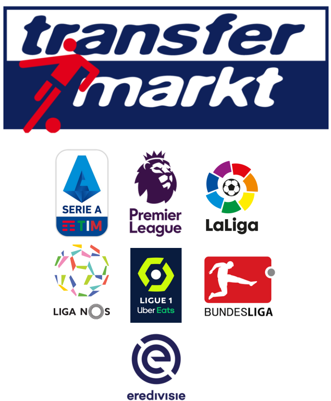

# Football Transfers Network Analisys

This Repository refers to the Final Project of the course Data Driven Models for Complex Systems (DDMCS) at University Sapienza of Rome 2022/2023.

# Dataset

The data comes from Kaggle, scraped from Transfer Markt. The datasets regards all the transfer operation in the major 7 European leagues from the 1992/1993 season to
the 2021/2022 season. The raw data were extremely dirty so a massive and detailed cleaning operation was necessary.
