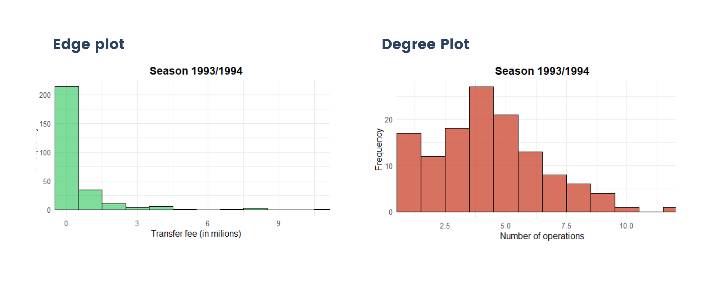
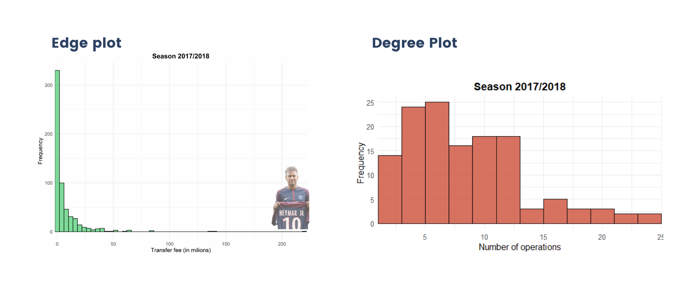

# Football Transfers Network Analisys

This Repository refers to the Final Project of the course Data Driven Models for Complex Systems (DDMCS) at University Sapienza of Rome 2022/2023.

# Abstract

## Files:
* `Code_R.R` contains all the code used to carry out all the various analyses performed in this work;
* `Functions.R` contains some functions defined here that are used in the `Code_R.R` file ;
* `PreProcessing.ipynb` notebook contains all the code used in preprocessing the data;
* `Scarping.ipynb` notebook contains all the code to scrape the extra data of transfer markt;
* `datasets_cleaned` folder has all the datasets used in this work;
* `Imgs` folder includes some of the Image and graphs carried out in my work.

# Dataset

The data comes from Kaggle, scraped from Transfer Markt. The datasets regards all the transfer operation in the major 7 European leagues from the 1992/1993 season to
the 2021/2022 season. The raw data were extremely dirty so a massive and detailed cleaning operation was necessary.

# Cleaning procedures

1. Scrape data from Transfer Markt to build two types of dictionaries:
 - one that maps every team name for every season its long name to the short one. (ex: "Juventus FC" : "Juventus").
 - one that maps each club not in the 7 top leagues in its continent/country. (ex: "Santos" : "South America").
 
2. Delete all the "out" and "End of loan" operations to avoid duplicate transactions.

3. Check and correct some typos in original data.

# Graph Builindg

Every team is a Node. If team A buys a player from team B, they are connected with a link, weighted with the fee and directed to B. For every season: 
* Nodes: 134
* Links: a) ~900 if one considers all transactions b)  ~600 if one considers only transactions from team of Top 7 European Leagues

# Results

## Degree

The degree of a team, represents how many different teams it has had negotiations with (both in and out). The Average degree of the teams has more
or less doubled over the seasons (from 4 to 7.5). The maximum degree of clubs has increased over time, although the effects are less noticeable than the average degree. After all, a team cannot make too many different deals per season, as 11 players always take the field.

In the figure above we can notice: 

* Most of the operations are loans
* There are only few Transfers with a fee > 5
Milion
* Each team on average is involved in deals
with 4 other clubs.
* Only a few clubs do business with more than
10 teams

In the recent years a lot of things are changed: 

* There are some edges with a high charge
* Three purchases exceed 100 million
* Each team on average is involved in deals
with 9 other clubs.
* 43 clubs over 134 do business with more
than 10 teams.
* Still a lot of transactions are loans

Until 2000, no purchase had ever exceeded 50 million. After the purchase of G. Bale, the Market exploded: at least 75 million was spent each year on a deal. Neymar to PSG for 225 million is the most expensive transfer in football history.

## Measures on the overall network

## Measures averaged by each league sub-network

## Modularity and Communities

## Centrality

## League Comparision

# Conlcusion

